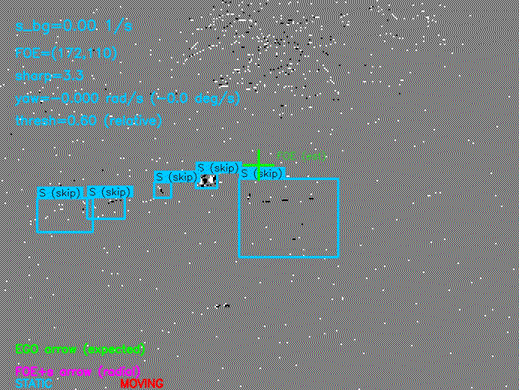

# GeoIMO: Geometry-Driven Independent Motion Classification for Event Cameras

Official code for the paper:

> **GeoIMO: Geometry-Driven Independent Motion Classification for Event Cameras**  
> Anil Bayram Gogebakan, Filippo Marostica, Alessio Caviglia, Alessandro Savino, Stefano Di Carlo  
> Politecnico di Torino, Turin, Italy  
> `{anil.gogebakan, filippo.marostica, alessio.caviglia, alessandro.savino, stefano.dicarlo}@polito.it`

## Overview

GeoIMO classifies detected objects as **static** or **independently moving** directly from event-camera streams, without learning or manual motion labels. It uses a Focus of Expansion (FOE) model with optional yaw compensation to estimate ego-motion, then compares local object motion against this global prediction via a scale-invariant residual.

## Example output



*MVSEC `outdoor_day2` sequence: static objects labelled **S**, independently moving objects labelled **M**.*

## Repository layout

```
geoimo/             # Source package
  README.md         # Algorithm reference (methods, options, flags)
  classify.py       # Classification entry point
  evaluate.py       # Evaluation entry point
  pipeline.py       # Main process_video() orchestration
  ego_motion.py     # FOE estimation, contrast maximisation
  bbox_motion.py    # Per-bbox velocity estimation
  tracking.py       # Kalman filters (ego-motion + per-bbox)
  residuals.py      # Residual / classification criterion
  contrast.py       # Polarity-split sharpness, FOE scoring modes
  intrinsics.py     # Camera intrinsics
  geometry.py       # IoU, NMS
  visualization.py  # Drawing helpers
  logging_utils.py  # Logging setup
third_party/
  prophesee/        # Vendored Prophesee SDK (Apache 2.0)
data/
  annotations/                    # Motion-state annotations provided with this repo
  MVSEC_prophesee_converter.py    # MVSEC HDF5 -> Prophesee .dat converter
  README.md                       # Dataset download + conversion instructions
assets/             # README media (demo GIF)
quickstart.sh       # End-to-end run wrapper (classify + evaluate)
geoimo.def          # Singularity/Apptainer container definition
requirements.txt    # Python dependencies (for non-container use)
LICENSE             # MIT (project); Apache 2.0 for the vendored SDK
```

## Requirements

### Container (recommended)

A `geoimo.def` file is provided for building a reproducible Singularity/Apptainer
container. Build it once with:

```bash
singularity build --fakeroot geoimo.sif geoimo.def
```

The resulting `geoimo.sif` is used by `quickstart.sh` automatically.

### Plain Python (no container)

```bash
pip install "numpy>=1.20" "opencv-python-headless>=4.5" "scipy>=1.7" "h5py>=3.0"
```

The pinned versions used in the provided container are `numpy==1.26.4`,
`opencv-python-headless==4.10.0.84`, `scipy==1.13.1`, `h5py==3.11.0` (Python 3.11).
`h5py` is only needed for the MVSEC HDF5 → `.dat` preprocessing step
(see [data/README.md](data/README.md)); the pipeline itself does not import it.

## Datasets

Event streams must be downloaded from their official sources and placed in the `data/` directory (these files are not distributed with this repository).

- **MVSEC** — [daniilidis-group.github.io/mvsec](https://daniilidis-group.github.io/mvsec/)
- **Prophesee 1 Megapixel Automotive Detection Dataset** — [prophesee.ai](https://www.prophesee.ai/2020/11/24/automotive-megapixel-event-based-dataset/)

See `data/README.md` for detailed download instructions and file naming conventions.

## Quickstart

Place the MVSEC `outdoor_day2` event file at `data/outdoor_day2_events.dat`, then run.
(MVSEC is distributed as HDF5 — see [data/README.md](data/README.md) for the one-time
conversion to the `.dat` format the pipeline expects.)

```bash
bash quickstart.sh
```

This runs the full pipeline (classification → evaluation) on the MVSEC sequence using the provided annotations. Output video and predictions are written to `output/`.

To run a Prophesee sequence, override the relevant variables:

```bash
DATASET=prophesee \
EVENT_PATH=data/moorea_2019-02-18_000_td_61500000_121500000_td.dat \
BBOX_PATH=data/annotations/moorea_2019-02-18_000_td_61500000_121500000_motion_labels.npy \
DELTA_T=16666 \
bash quickstart.sh
```

> **delta_t recommendation:** `22858 µs` for MVSEC and `16666 µs` for Prophesee match the GT annotation rate of each dataset (~43.7 fps and ~60 fps respectively), and are the right choice when comparing predictions against the ground truth frame-for-frame. The `quickstart.sh` MVSEC default is `91432 µs` (4× the GT interval) — the best-performing configuration reported in the paper. Override `DELTA_T` to switch.

For manual invocation without the script, see `data/README.md`.

## Key flags

| Flag | Default | Description |
|---|---|---|
| `--enable_yaw` | off | Enable yaw (ω_y) estimation via L-BFGS-B |
| `--bbox_method` | `both` | `translational`, `radial`, or `both` |
| `--residual_method` | `relative_dynamic` | Classification criterion |
| `--threshold` | -1 | Residual threshold (-1 = method default) |
| `--delta_t` | 22858 | Frame duration in µs |
| `--dataset` | auto | `mvsec`, `prophesee`, or auto-detect |

Run `python -m geoimo.classify --help` for the full list, and see
[geoimo/README.md](geoimo/README.md) for a detailed description of the methods
and every option.

## Annotations

`data/annotations/` contains motion-state labels manually annotated by the authors
for five sequences: one MVSEC `outdoor_day2` sequence and four Prophesee 1 Megapixel
Automotive Detection Dataset sequences. Annotations use the Prophesee bounding box
format with four classes encoding both object type and motion state
(person/vehicle × static/moving).

See [data/README.md](data/README.md) for the full class scheme, per-sequence file
listing, and annotation methodology.

## Citation

If you use this code, please cite:

```bibtex
@misc{gogebakan2026geoimogeometrydrivenindependentmotion,
      title={GeoIMO: Geometry-Driven Independent Motion Classification for Event Cameras}, 
      author={Anil Bayram Gogebakan and Filippo Marostica and Alessio Caviglia and Alessandro Savino and Stefano Di Carlo},
      year={2026},
      eprint={2606.24499},
      archivePrefix={arXiv},
      primaryClass={cs.CV},
      url={https://arxiv.org/abs/2606.24499}, 
}
```

<!-- TODO: replace with the final venue/DOI once published. -->

## License

This project is licensed under the MIT License — see [LICENSE](LICENSE).  
The vendored Prophesee SDK in `third_party/prophesee/` is Apache 2.0 licensed.
